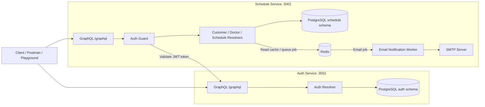

# Scheduling System Healthcare

Sistem Penjadwalan Healthcare backend microservice berbasis NestJS untuk mengelola jadwal konsultasi klinik antara customer dan doctor.

Repository ini berisi 2 service:

- `auth-service` pada port `3001`
- `schedule-service` pada port `3002`

Kedua service menyediakan endpoint GraphQL pada path `/graphql`.

---

## Tech Stack

- NestJS
- GraphQL 
- PostgreSQL
- Prisma ORM
- Autentikasi JWT
- Docker dan Docker Compose
- Redis
  - Backend queue untuk BullMQ
  - Query cache untuk read API tertentu
- BullMQ (antrean notifikasi email)
- Nodemailer (pengiriman email via SMTP)
- Jest + `@nestjs/testing` (unit testing)

---

## Arsitektur Sistem



---

## Struktur Proyek

```text
healthcare-scheduling/
|-- .env.example
|-- docker-compose.yml
|-- README.md
|-- auth-service/
|   |-- Dockerfile
|   |-- prisma/schema.prisma
|   |-- src/
|   `-- test/
|-- schedule-service/
|   |-- Dockerfile
|   |-- prisma/schema.prisma
|   |-- src/
|   `-- test/
|-- docs/
|   |-- graphql-queries.md
|   `-- healthcare-scheduling.postman_collection.json
```

---

## Service Url

- Auth GraphQL: `http://localhost:3001/graphql`
- Schedule GraphQL: `http://localhost:3002/graphql`
- Postgres: `localhost:5432`
- Redis: `localhost:6379`

---

## Alur Autentikasi

1. Client melakukan register atau login melalui Auth Service.
2. Auth Service mengembalikan access token JWT.
3. Client mengirim `Authorization: Bearer <token>` ke Schedule Service.
4. `AuthGuard` pada Schedule Service mengekstrak bearer token.
5. Schedule Service memanggil query GraphQL Auth Service: `validateToken(token: String!)`.
6. Jika token valid, request dilanjutkan. Jika tidak valid, request ditolak.

---

## GraphQL

### Auth Service

File referensi:

```text
auth-service/src/modules/auth/resolvers/auth.resolver.ts
```

Operasi:

- `mutation register(input: RegisterInput!): UserOutput!`
- `mutation login(input: LoginInput!): AuthTokenOutput!`
- `query validateToken(token: String!): UserOutput!`

### Schedule Service

File referensi:

```text
schedule-service/src/modules/**/resolvers/*.resolver.ts
```

Semua operasi Schedule Service dilindungi `@UseGuards(AuthGuard)`.

Customer:

- `mutation createCustomer(input: CreateCustomerInput!): CustomerOutput!`
- `mutation updateCustomer(input: UpdateCustomerInput!): CustomerOutput!`
- `query customers(input: CustomerPaginationInput): CustomerListOutput!`
- `query customer(input: CustomerIdInput!): CustomerOutput!`
- `mutation deleteCustomer(input: CustomerIdInput!): CustomerOutput!`

Doctor:

- `mutation createDoctor(input: CreateDoctorInput!): DoctorOutput!`
- `mutation updateDoctor(input: UpdateDoctorInput!): DoctorOutput!`
- `query doctors(input: DoctorPaginationInput): DoctorListOutput!`
- `query doctor(input: DoctorIdInput!): DoctorOutput!`
- `mutation deleteDoctor(input: DoctorIdInput!): DoctorOutput!`

Schedule:

- `mutation createSchedule(input: CreateScheduleInput!): ScheduleOutput!`
- `mutation updateScheduleStatus(input: UpdateScheduleStatusInput!): ScheduleOutput!`
- `query schedules(input: ScheduleQueryInput): ScheduleListOutput!`
- `query schedule(input: ScheduleIdInput!): ScheduleOutput!`
- `mutation deleteSchedule(input: ScheduleIdInput!): ScheduleOutput!`

Enum status schedule:

- `PENDING`: jadwal sudah dibuat, tetapi konsultasi belum dilaksanakan.
- `COMPLETED`: konsultasi sudah selesai dilaksanakan.
- `CANCELED`: jadwal dibatalkan dan tidak dilaksanakan.

Catatan:

- Saat `createSchedule`, field `status` bersifat opsional. Jika tidak diisi, nilai default di database adalah `PENDING`.
- `scheduledAt` menggunakan format waktu ISO-8601 UTC, contoh: `2026-06-01T09:00:00.000Z`.
- Asumsi durasi pemeriksaan adalah 30 menit. Sistem menolak jadwal dokter yang selisih waktunya kurang dari 30 menit dari jadwal dokter lain.
- jwt session expired 1 hours karena tidak menggunakan session management

---

## Variabel Environment Wajib

Proyek ini menggunakan file `.env` di root, mengikuti format `.env.example`.

| Variable | Digunakan oleh | Kegunaan |
|---|---|---|
| `NODE_ENV` | auth, schedule | Mode aplikasi (`development/production/test`) |
| `POSTGRES_USER` | postgres | User Postgres |
| `POSTGRES_PASSWORD` | postgres | Password Postgres |
| `POSTGRES_DB` | postgres | Nama database Postgres |
| `POSTGRES_PORT` | postgres | Port Postgres yang diekspos |
| `REDIS_HOST` | schedule, redis | Host Redis |
| `REDIS_PORT` | schedule, redis | Port Redis |
| `REDIS_PASSWORD` | schedule, redis | Password Redis (opsional) |
| `CACHE_ENABLED` | schedule | Mengaktifkan/nonaktifkan Redis query cache |
| `CACHE_TTL_SECONDS` | schedule | Durasi cache dalam detik |
| `AUTH_SERVICE_PORT` | auth | Port container Auth Service |
| `SCHEDULE_SERVICE_PORT` | schedule | Port container Schedule Service |
| `AUTH_DATABASE_URL` | auth | URL Postgres untuk schema auth |
| `SCHEDULE_DATABASE_URL` | schedule | URL Postgres untuk schema schedule |
| `JWT_SECRET` | auth | Secret untuk signing JWT |
| `JWT_EXPIRES_IN` | auth | Masa berlaku JWT, contoh `1h` |
| `AUTH_GRAPHQL_PLAYGROUND` | auth | Mengaktifkan GraphQL Playground Auth Service |
| `SCHEDULE_GRAPHQL_PLAYGROUND` | schedule | Mengaktifkan GraphQL Playground Schedule Service |
| `AUTH_SERVICE_GRAPHQL_URL` | schedule | URL GraphQL Auth Service untuk validasi token |
| `AUTH_SERVICE_TIMEOUT_MS` | schedule | Timeout validasi token ke Auth Service |
| `EMAIL_FROM` | schedule | Alamat pengirim email |
| `SMTP_HOST` | schedule | Host SMTP |
| `SMTP_PORT` | schedule | Port SMTP |
| `SMTP_USER` | schedule | Username SMTP |
| `SMTP_PASSWORD` | schedule | Password SMTP |

---

## Cara Menjalankan Proyek

1. Buat `.env` dari contoh:

```bash
cp .env.example .env
```

2. Jalankan semua container:

```bash
docker compose up --build
```

3. Verifikasi endpoint:

```text
http://localhost:3001/graphql
http://localhost:3002/graphql
```

4. Hentikan container:

```bash
docker compose down
```

---

## Runtime di Docker Compose

Kedua service menjalankan command berikut saat startup:

```bash
npx prisma generate --schema prisma/schema.prisma
npx prisma db push --schema prisma/schema.prisma
npm run start
```

Artinya sinkronisasi schema berjalan otomatis saat container start.

---

## Perintah Docker Compose

```bash
docker compose up --build
docker compose ps
docker compose logs -f auth-service
docker compose logs -f schedule-service
docker compose logs -f redis
docker compose exec redis redis-cli ping
docker compose down
```

Jika Redis berjalan normal, command berikut:

```bash
docker compose exec redis redis-cli ping
```

akan mengembalikan:

```text
PONG
```

---

## Redis

Redis digunakan oleh Schedule Service untuk dua kebutuhan:

- Backend queue untuk BullMQ email notification.
- Query cache untuk read API customer, doctor, dan schedule.

Redis otomatis dijalankan melalui Docker Compose.

Cek status Redis:

```bash
docker compose ps redis
```

Cek log Redis:

```bash
docker compose logs -f redis
```

Tes koneksi Redis:

```bash
docker compose exec redis redis-cli ping
```

---

## Perintah Prisma

Di dalam container:

```bash
docker compose exec auth-service npx prisma generate --schema prisma/schema.prisma
docker compose exec auth-service npx prisma db push --schema prisma/schema.prisma

docker compose exec schedule-service npx prisma generate --schema prisma/schema.prisma
docker compose exec schedule-service npx prisma db push --schema prisma/schema.prisma
```

Jika ingin menggunakan file migration:

```bash
docker compose exec auth-service npx prisma migrate dev --schema prisma/schema.prisma --name init
docker compose exec schedule-service npx prisma migrate dev --schema prisma/schema.prisma --name init
```

---

## Contoh GraphQL

### Auth Service

Endpoint:

```text
http://localhost:3001/graphql
```

Register:

```graphql
mutation Register($input: RegisterInput!) {
  register(input: $input) {
    id
    email
    createdAt
    updatedAt
  }
}
```

Variables:

```json
{
  "input": {
    "email": "user@example.com",
    "password": "StrongPassword123!"
  }
}
```

Login:

```graphql
mutation Login($input: LoginInput!) {
  login(input: $input) {
    accessToken
    tokenType
    expiresIn
    user {
      id
      email
    }
  }
}
```

Validate token:

```graphql
query ValidateToken($token: String!) {
  validateToken(token: $token) {
    id
    email
  }
}
```

---

### Schedule Service

Endpoint:

```text
http://localhost:3002/graphql
```

Header wajib untuk semua request:

```http
Authorization: Bearer <access_token>
```

Create customer:

```graphql
mutation CreateCustomer($input: CreateCustomerInput!) {
  createCustomer(input: $input) {
    id
    name
    email
    createdAt
    updatedAt
  }
}
```

Update customer:

```graphql
mutation UpdateCustomer($input: UpdateCustomerInput!) {
  updateCustomer(input: $input) {
    id
    name
    email
    updatedAt
  }
}
```

List customer:

```graphql
query Customers($input: CustomerPaginationInput) {
  customers(input: $input) {
    items {
      id
      name
      email
    }
    total
    skip
    take
  }
}
```

Get customer by ID:

```graphql
query Customer($input: CustomerIdInput!) {
  customer(input: $input) {
    id
    name
    email
  }
}
```

Delete customer:

```graphql
mutation DeleteCustomer($input: CustomerIdInput!) {
  deleteCustomer(input: $input) {
    id
    name
    email
  }
}
```

Create doctor:

```graphql
mutation CreateDoctor($input: CreateDoctorInput!) {
  createDoctor(input: $input) {
    id
    name
    createdAt
    updatedAt
  }
}
```

Update doctor:

```graphql
mutation UpdateDoctor($input: UpdateDoctorInput!) {
  updateDoctor(input: $input) {
    id
    name
    updatedAt
  }
}
```

List doctor:

```graphql
query Doctors($input: DoctorPaginationInput) {
  doctors(input: $input) {
    items {
      id
      name
    }
    total
    skip
    take
  }
}
```

Get doctor by ID:

```graphql
query Doctor($input: DoctorIdInput!) {
  doctor(input: $input) {
    id
    name
    createdAt
    updatedAt
  }
}
```

Delete doctor:

```graphql
mutation DeleteDoctor($input: DoctorIdInput!) {
  deleteDoctor(input: $input) {
    id
    name
  }
}
```

Create schedule:

```graphql
mutation CreateSchedule($input: CreateScheduleInput!) {
  createSchedule(input: $input) {
    id
    objective
    customerId
    doctorId
    scheduledAt
    status
    createdAt
    updatedAt
  }
}
```

Variables:

```json
{
  "input": {
    "objective": "General consultation",
    "customerId": "<customer_uuid>",
    "doctorId": "<doctor_uuid>",
    "scheduledAt": "2026-06-01T09:00:00.000Z",
    "status": "PENDING"
  }
}
```

Update status schedule:

```graphql
mutation UpdateScheduleStatus($input: UpdateScheduleStatusInput!) {
  updateScheduleStatus(input: $input) {
    id
    status
    updatedAt
  }
}
```

Variables:

```json
{
  "input": {
    "id": "<schedule_uuid>",
    "status": "COMPLETED"
  }
}
```

List schedule:

```graphql
query Schedules($input: ScheduleQueryInput) {
  schedules(input: $input) {
    items {
      id
      objective
      customerId
      doctorId
      scheduledAt
      status
    }
    total
    skip
    take
  }
}
```

Get schedule by ID:

```graphql
query Schedule($input: ScheduleIdInput!) {
  schedule(input: $input) {
    id
    objective
    customerId
    doctorId
    scheduledAt
    status
  }
}
```

Delete schedule:

```graphql
mutation DeleteSchedule($input: ScheduleIdInput!) {
  deleteSchedule(input: $input) {
    id
    objective
    status
  }
}
```

---

## Alur Pengujian Manual

Urutan pengujian manual yang direkomendasikan:

1. Register user.
2. Login user dan simpan `accessToken`.
3. Validate token melalui Auth Service.
4. Create customer dan simpan `customer_id`.
5. Create doctor dan simpan `doctor_id`.
6. Create schedule dan simpan `schedule_id`.
7. Query list schedule dengan filter.
8. Jalankan negative test:
   - request tanpa token
   - request dengan token invalid
   - konflik jadwal dokter kurang dari 30 menit
9. Cleanup data yang dibuat:
   - schedule
   - doctor
   - customer

Gunakan file Postman di folder `docs/`:

- `docs\Healthcare Scheduling System - GraphQL.postman_collection.json`

---

## Unit Testing

Project ini menggunakan:

- Jest
- `@nestjs/testing`
- TypeScript test files (`*.spec.ts`)

File unit test ditempatkan di folder `test/` yang sejajar dengan `src/`.

```text
auth-service/
|-- src/
`-- test/

schedule-service/
|-- src/
`-- test/
```

Menjalankan test Auth Service:

```bash
cd auth-service
npm run test
```

Menjalankan coverage Auth Service:

```bash
cd auth-service
npm run test:cov
```

Menjalankan test Schedule Service:

```bash
cd schedule-service
npm run test
```

Menjalankan coverage Schedule Service:

```bash
cd schedule-service
npm run test:cov
```

Catatan:

- Unit test menggunakan mock untuk database, Redis, dan external service.
- Unit test tidak membutuhkan koneksi langsung ke PostgreSQL atau Redis.
- Coverage dapat dicek melalui output `npm run test:cov`.

---

## Fitur Bonus yang Sudah Diimplementasikan

- Notifikasi email saat schedule dibuat, selesai (`COMPLETED`), dan dihapus.
- Pemrosesan email berbasis queue menggunakan BullMQ.
- Container Redis sudah terhubung di `docker-compose.yml`.
- Redis digunakan sebagai backend queue BullMQ.
- Redis query cache untuk read API customer, doctor, dan schedule.
- Integrasi SMTP menggunakan Nodemailer.
- Automated unit test menggunakan Jest dan `@nestjs/testing`.

---

## Catatan Penting

- File schema GraphQL tidak di-commit ke repository (`src/schema.gql` digenerate saat runtime).
- Schedule Service melakukan validasi token ke Auth Service lewat variable query GraphQL `token`.
- Untuk request ke Schedule Service, client tetap wajib mengirim header `Authorization: Bearer <access_token>`.
